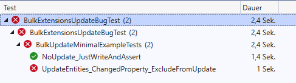
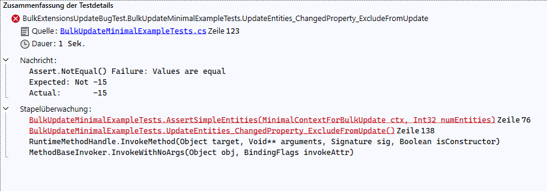

# BulkExtensionsUpdateBugExample

## Setup


Adjust the settings in the file `GlobalExampleConfig.cs` to your needs.
```CSharp
internal static class GlobalExampleConfig
{
	public static string SERVER { get; }		= "localhost";
	public static uint PORT { get; }		= 3306;
	public static string DATABASE_NAME { get; }	= "BulkUpdateTests";
	public static string USER_NAME { get; }		= "<Your Username Here>";
	public static string PASSWORD { get; }		= "<Your Password Here>";
}
```

## Tests

**This bug happens in the MySQL implementation of the BulkExtensions package.**


To see the supposed bug in action run the test from the project.\
Currently, the test should fail as shown in the image below.



`NoUpdate_JustWriteAndAssert` is kind of a baseline test that should always pass.\
This test just writes entities to the DB and then verifies the values are correct.

The test `UpdateEntities_ChangedPropertiy_ExcludeFromUpdate` is the one that is supposed to fail.\
The Message should be as in the image below.



## What happened in `UpdateEntities_ChangedPropertiy_ExcludeFromUpdate`:
* N new entities written to the empty database
* then N new entities with the same IDs but other values are used to update the existing entities using the **`BulkUpdate NuGet-package`**
* from these "update entities" only one property is set up to actually being updated 
```CSharp
ctx.BulkUpdate(updateEntities, options =>
{
	options.PropertiesToIncludeOnUpdate = BULK_UPDATE_CFG.PropertiesToIncludeOnUpdate;
});
```
 
* the test shows (and therefore fails) that both properties were updated

## Other Notes
* the MS-SQL implementation works fine
* there are multiple different, similar options (PropertiesToExclude, PropertiesToExcludeOnUpdate, PropertiesToInclude, PropertiesToIncludeOnUpdate), non of which worked for MySQL
* I did not find another option to influence that given update behavior (for MySQL)
